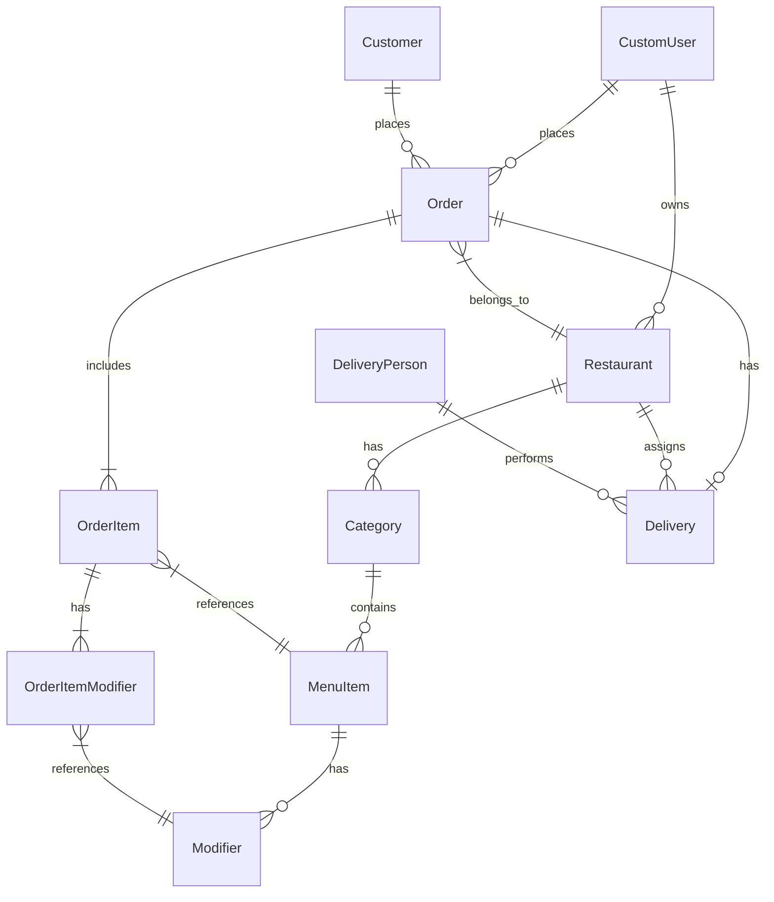

# Food Delivery API (Python, Django & Django REST)
This project is a simple backend API for a food delivery company, built using Django and Django Rest Framework (DRF). The API handles user registration and login, menu management, and order placement, with role-based permissions for users.
<!DOCTYPE html>
<h1>Food Delivery Service Database Schema</h1>
<h2>Entities and Relationships</h2>
<h3>User</h3>
<ul>
  <li>Fields:
    <ul>
      <li>id (PK)</li>
      <li>username</li>
      <li>email</li>
      <li>password_hash</li>
      <li>role</li>
      <li>created_at</li>
      <li>updated_at</li>
    </ul>
  </li>
  <li>Relationships:
    <ul>
      <li>User (1) - (0..N) Restaurant (A user can own multiple restaurants)</li>
      <li>User (1) - (0..N) Order (As a customer)</li>
      <li>User (1) - (0..N) Delivery (As a delivery person)</li>
    </ul>
  </li>
</ul>
<h3>Customer</h3>
<ul>
  <li>Fields:
    <ul>
      <li>id (PK)</li>
      <li>user</li>
      <li>phone_number</li>
      <li>gender </li>
      <li>location </li>
      <li>city</li>
      <li>country</li>
    </ul>
  </li>
</ul>
<h3>Restaurant</h3>
<ul>
  <li>Fields:
    <ul>
      <li>id (PK)</li>
      <li>owner_id (FK to User)</li>
      <li>name</li>
      <li>description</li>
      <li>address</li>
      <li>phone_number</li>
      <li>cuisine_type</li>
      <li>operating_hours</li>
      <li>created_at</li>
      <li>updated_at</li>
    </ul>
  </li>
  <li>Relationships:
    <ul>
      <li>Restaurant (1) - (0..N) MenuCategory</li>
      <li>Restaurant (1) - (0..N) MenuItem</li>
      <li>Restaurant (1) - (0..N) Order</li>
    </ul>
  </li>
</ul>
<h3>MenuCategory</h3>
<ul>
  <li>Fields:
    <ul>
      <li>id (PK)</li>
      <li>restaurant_id (FK to Restaurant)</li>
      <li>name</li>
      <li>description</li>
      <li>created_at</li>
      <li>updated_at</li>
    </ul>
  </li>
  <li>Relationships:
    <ul>
      <li>MenuCategory (1) - (0..N) MenuItem</li>
    </ul>
  </li>
</ul>
<h3>MenuItem</h3>
<ul>
  <li>Fields:
    <ul>
      <li>id (PK)</li>
      <li>category_id (FK to MenuCategory)</li>
      <li>restaurant_id (FK to Restaurant)</li>
      <li>name</li>
      <li>description</li>
      <li>price</li>
      <li>is_available</li>
      <li>created_at</li>
      <li>updated_at</li>
    </ul>
  </li>
  <li>Relationships:
    <ul>
      <li>MenuItem (1) - (0..N) Modifier</li>
    </ul>
  </li>
</ul>
<h3>Modifier</h3>
<ul>
  <li>Fields:
    <ul>
      <li>id (PK)</li>
      <li>menu_item_id (FK to MenuItem)</li>
      <li>name</li>
      <li>price</li>
      <li>is_required</li>
      <li>created_at</li>
      <li>updated_at</li>
    </ul>
  </li>
</ul>
<h3>Order</h3>
<ul>
  <li>Fields:
    <ul>
      <li>id (PK)</li>
      <li>customer_id (FK to User)</li>
      <li>restaurant_id (FK to Restaurant)</li>
      <li>status</li>
      <li>total_amount</li>
      <li>created_at</li>
      <li>updated_at</li>
    </ul>
  </li>
  <li>Relationships:
    <ul>
      <li>Order (1) - (1..N) OrderItem</li>
      <li>Order (1) - (0..1) Delivery</li>
    </ul>
  </li>
</ul>
<h3>OrderItem</h3>
<ul>
  <li>Fields:
    <ul>
      <li>id (PK)</li>
      <li>order_id (FK to Order)</li>
      <li>menu_item_id (FK to MenuItem)</li>
      <li>quantity</li>
      <li>unit_price</li>
      <li>subtotal</li>
      <li>created_at</li>
      <li>updated_at</li>
    </ul>
  </li>
  <li>Relationships:
    <ul>
      <li>OrderItem (1) - (0..N) OrderItemModifier</li>
    </ul>
  </li>
</ul>
<h3>OrderItemModifier</h3>
<ul>
  <li>Fields:
    <ul>
      <li>id (PK)</li>
      <li>order_item_id (FK to OrderItem)</li>
      <li>modifier_id (FK to Modifier)</li>
      <li>quantity</li>
      <li>unit_price</li>
      <li>subtotal</li>
      <li>created_at</li>
      <li>updated_at</li>
    </ul>
  </li>
</ul>
<h3>Delivery</h3>
<ul>
  <li>Fields:
    <ul>
      <li>id (PK)</li>
      <li>order_id (FK to Order)</li>
      <li>delivery_person_id (FK to User)</li>
      <li>status</li>
      <li>pickup_time</li>
      <li>estimated_delivery_time</li>
      <li>actual_delivery_time</li>
      <li>created_at</li>
      <li>updated_at</li>
    </ul>
  </li>
</ul>
<h2>ER Diagram</h2>

## Custom Permissions

This project includes custom permission classes to manage access based on user roles. Below is an overview of each permission and its purpose:

### 1. `IsOwnerOrEmployee`

**Purpose:**  
This permission ensures that only **restaurant owners** and **employees** can create or modify menu items, categories, and modifiers. Any authenticated user can view them.

**Usage:**
- **Owners/Employees**: Can create, modify, and delete menu items and categories.
- **Customers/Other Users**: Can only view menu items and categories.

### 2. `IsOwnerOrEmployeeOrCustomerReadOnly`

**Purpose:**  
This permission is designed to:
- Allow **owners** and **employees** to view orders related to their restaurant.
- Allow **customers** to view only their own orders.
- Allow any authenticated user to create orders.

**Usage:**
- **Owners/Employees**: Can view and manage orders for their restaurant.
- **Customers**: Can only view their own orders.
- **Authenticated Users**: Can create new orders.

### 3. `IsOwnerOrDeliveryPerson`

**Purpose:**  
This permission ensures that only **restaurant owners** can assign delivery persons to an order, and only **delivery persons** can view and update their assigned deliveries.

**Usage:**
- **Owners**: Can assign delivery personnel to orders for their restaurant.
- **Delivery Personnel**: Can view and manage deliveries assigned to them.

---

These custom permissions provide role-based access control throughout the API, ensuring that users can only interact with data relevant to their role within the food delivery system.

## API Documentation
Api documentations are available on swagger

